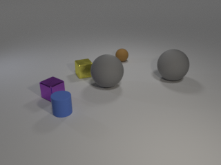
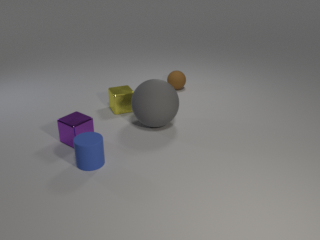

# CLEVR Diff Dataset

Code to generate pairs of CLEVR style images with an obvious difference.

You can use this code to render pairs of synthetic images and difference for those images, like this:

<div align="left">
  
</div>
<div align="right">
  
</div>

For the above example, generated difference,
```
{
   "image_index": 0,
   "difference_type": "deleted",
   "image_filename_deleted_diff": "CLEVR_new_000000_del.png",
   "location": {
      "pixel_coords": [
         251,
         95,
         10.763978
      ],
      "rotation": 325.82462,
      "3d_coords": [
         1.627432,
         2.2852376,
         0.7
      ]
   },
   "attributes": {
      "color": "gray",
      "shape": "sphere",
      "material": "rubber",
      "size": "large"
   },
   "difference": "The large gray sphere made of rubber is missing",
   "image_filename": "CLEVR_new_000000.png"
}
```

To generate such pair of images, use the following command,
```
blender --background --python render_images.py -- --num_images 300 --del_images 1 --use_gpu 1
```

To generate the difference between the images,
```
python generate_questions.py --del_images 1
```

Refer to [CLEVR Dataset Generation repo](https://github.com/facebookresearch/clevr-dataset-gen/blob/master/README.md) for setting up blender and learning more about the code.
